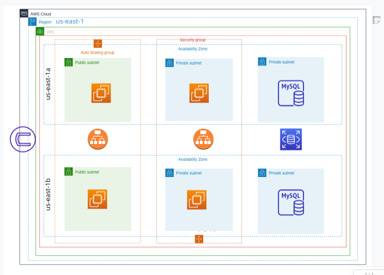

# AWS-3-Tier-Architecture-project.
Set up a three-tier architecture project on AWS that includes auto-scaling across various sub-regions and configure an RDS database using MySQL.

## What is 3-tier architecture ?
  * A three-tier architecture is a software development model that separates an application's functionality into three distinct layers:
presentation, business logic, and data. The three tiers are logical, not physical, and can be developed, updated, or scaled independently.

## Architecture of this project

